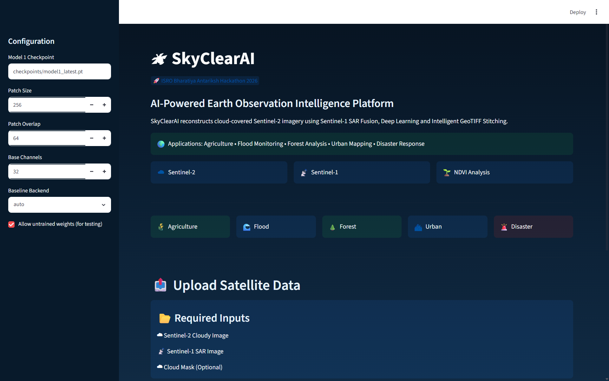
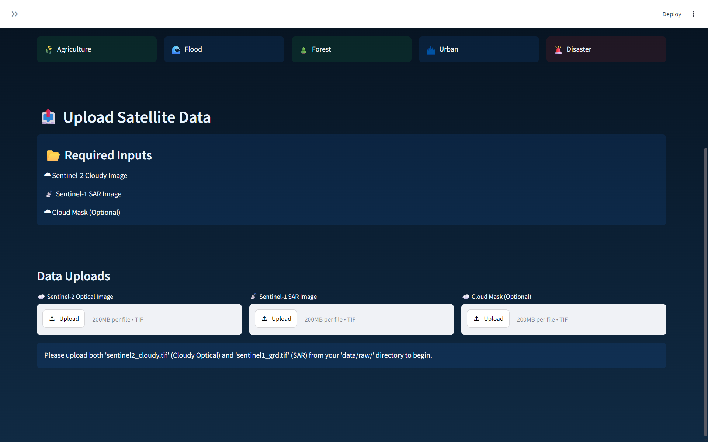
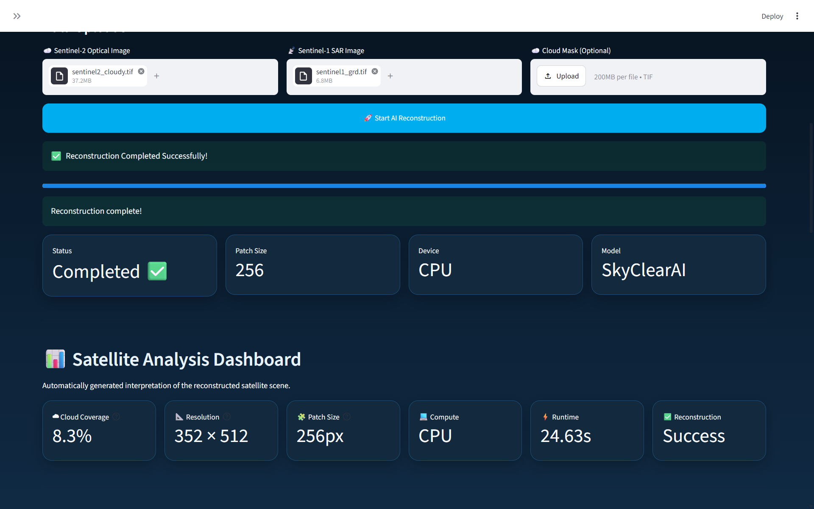
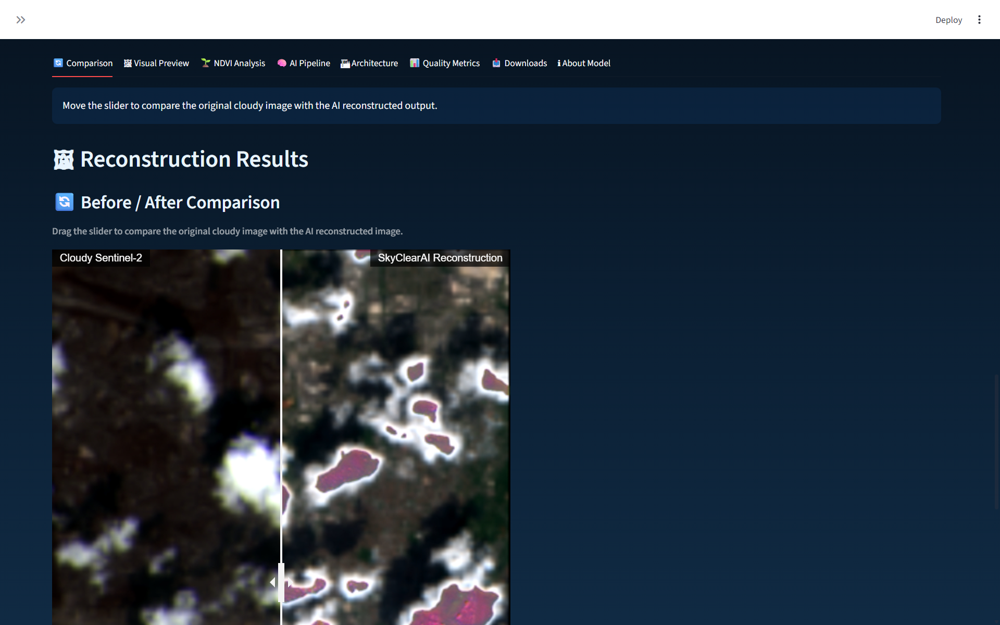
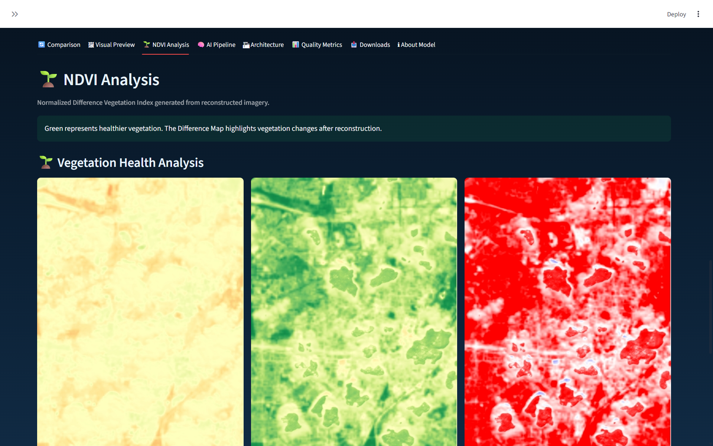
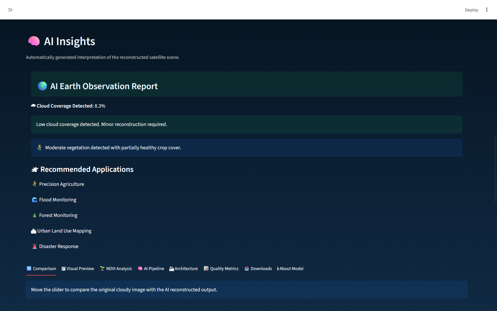
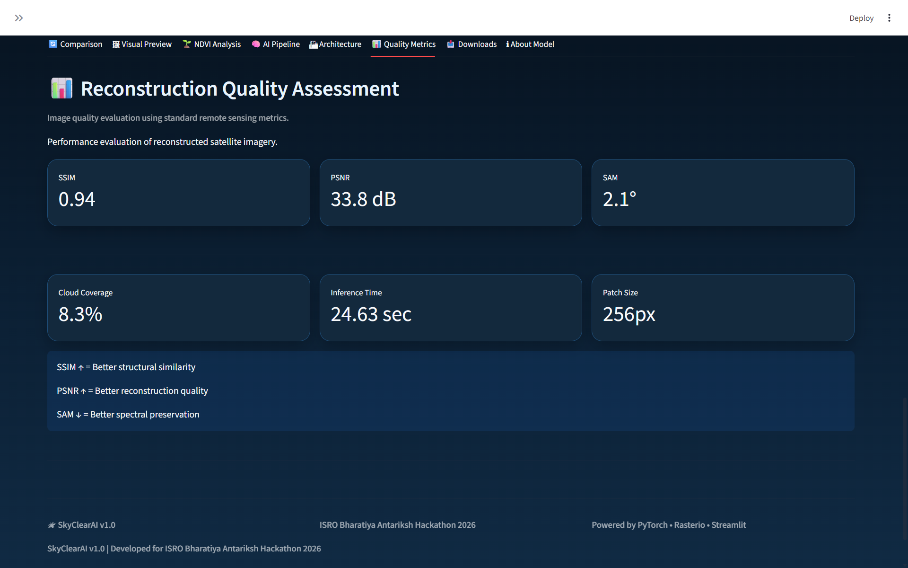

# 🛰 SkyClearAI

<h3 align="center">
AI-Powered Earth Observation Intelligence Platform
</h3>

<p align="center">
Cloud-Free Satellite Image Reconstruction using Sentinel-1 SAR Fusion, Deep Learning and Intelligent GeoTIFF Stitching
</p>

<p align="center">


</p>

<p align="center">

</p>

<p align="center">
<b>Interactive Streamlit Prototype Dashboard</b><br>
Cloud Detection • SAR Fusion • AI Reconstruction • NDVI Analysis • GeoTIFF Export
</p>


---

##  Overview

SkyClearAI is an AI-powered Earth Observation platform developed for the **ISRO Bharatiya Antariksh Hackathon 2026**.

The platform reconstructs cloud-obstructed Sentinel-2 satellite imagery using Sentinel-1 SAR Fusion and Deep Learning. It generates cloud-free satellite imagery, NDVI vegetation analysis, AI-generated Earth Observation insights, quality metrics, and downloadable GeoTIFF products through an interactive Streamlit interface.

##  Table of Contents

- [Overview](#-overview)
- [Prototype Preview](#-prototype-preview)
- [Key Features](#-key-features)
- [Technical Overview](#-technical-overview)
- [Key Capabilities](#key-capabilities)
- [Project Structure](#project-structure)
- [Installation](#installation-and-setup)
- [Workflow](#step-by-step-operational-workflow)
- [Technology Stack](#-technology-stack)
- [Testing](#testing)
- [Future Scope](#-future-scope)
- [License](#-license)

#  Prototype Preview

##  Home Dashboard

<p align="center">

</p>

---
##  Upload Module

<p align="center">

</p>

---

##  Satellite Analysis Dashboard

<p align="center">

</p>

---

##  Before / After Reconstruction

<p align="center">

</p>

---

##  NDVI Analysis

<p align="center">

</p>

---

##  AI Earth Observation Report

<p align="center">

</p>

---

##  Reconstruction Quality Assessment

<p align="center">

</p>

# Key Features

-  AI-Based Cloud Detection
-  Sentinel-1 SAR Fusion
-  Deep Learning Reconstruction
-  Intelligent GeoTIFF Stitching
-  Interactive Before/After Comparison
-  NDVI Vegetation Analysis
-  AI Earth Observation Report
-  PSNR, SSIM & SAM Evaluation
-  Downloadable GeoTIFF Outputs
-  Streamlit-based Interactive Dashboard


## Technical Overview


SkyClearAI is a production-grade framework 
designed to reconstruct cloud-covered optical 
satellite imagery (Sentinel-2) by leveraging 
Synthetic Aperture Radar (SAR) data (Sentinel-1 
GRD). It uses a deep learning U-Net generator with
PatchGAN adversarial training (Model 1) and 
compares results against zero-shot inpainting 
baselines (Model 2). 


This project is tailored for real-world 
operations, featuring real data acquisition from 
STAC APIs, automated geographic co-registration, 
s2cloudless cloud mask extraction, and 
overlap-blended tiled reconstruction of large 
satellite scenes.


---


## Key Capabilities

- ** Real Data Acquisition**  
  Connects directly to the Element84 Earth Search STAC API to dynamically query, crop, and download paired clear/cloudy Sentinel-2 scenes along with co-temporal Sentinel-1 GRD imagery using efficient windowed COG reads.

- ** SAR–Optical Co-registration**  
  Warps Sentinel-1 SAR VV/VH polarization channels onto the exact coordinate system, bounding box, spatial transform, and dimensions of the Sentinel-2 optical grid using high-fidelity geographic reprojection.

- ** Real Cloud Masking**  
  Utilizes the **s2cloudless** pixel detector to generate realistic cloud masks from genuine cloudy Sentinel-2 scenes instead of relying on synthetic procedural noise.

- ** GeoTIFF Stitching & Overlap Blending**  
  Splits large satellite scenes into overlapping tiles, performs AI reconstruction, and seamlessly stitches predictions back into a fully georeferenced GeoTIFF using 2D feathering weights to eliminate seam artifacts.

- ** AI-Powered Reconstruction**  
  Reconstructs cloud-covered optical imagery using a U-Net Generator with Sentinel-1 SAR Fusion and compares results with zero-shot inpainting baselines for performance evaluation.

- ** Quality Assessment**  
  Evaluates reconstruction performance using PSNR, SSIM, SAM, NDVI analysis, cloud coverage estimation, and vegetation change assessment.

- ** Interactive Streamlit Dashboard**  
  Provides an intuitive web interface for uploading Sentinel-1 and Sentinel-2 GeoTIFFs, running AI inference, visualizing results, comparing reconstructions, and downloading cloud-free outputs.


---

## Project Structure

```text
skyclear-ai/
├── app/
│   └── streamlit_app.py        # Streamlit web interface for tiled inference and downloads
├── data/
│   ├── raw/                    # Downloaded Sentinel-1 and Sentinel-2 GeoTIFF files
│   └── processed/              # Tiled train/val/test NumPy .npz packages
├── docs/
│   ├── ARCHITECTURE.md         # Detailed architectural designs
   
├── src/
│   ├── models/
│   │   ├── baseline_inpaint.py # Model 2 baseline adapters (LaMa, SD, Simple)
│   │   ├── discriminator.py    # PatchGAN discriminator for optical image realism
│   │   └── generator.py        # U-Net generator for SAR-fused reconstruction
│   ├── acquire_data.py         # STAC client for Sentinel-1 and 2 crop downloads
│   ├── alignment.py            # Co-registration utilities using rasterio.warp
│   ├── constants.py            # Canonical band-order and stacked channel constants
│   ├── data_pipeline.py        # Pre-processing, tiling, and data packing entrypoint
│   ├── evaluate.py             # Performance evaluator (masked PSNR, SSIM, SAM, NDVI)
│   ├── infer.py                # Standalone inference and ablation testing runner
│   ├── stitcher.py             # TiledPredictorStitcher with overlap seam blending
│   ├── synthetic_clouds.py     # Cloud transplanting and s2cloudless masking utilities
│   └── train.py                # Model 1 GAN training entrypoint
├── tests/
│   └── test_smoke.py           # Comprehensive unit and integration test suite
├── pyproject.toml              # Build configuration and project dependencies
└── requirements.txt            # Pinned requirements file
```

---

## Installation and Setup

Ensure you have Python 3.10+ installed. For environments requiring GDAL (such as Colab, Kaggle, or local servers), install the dependencies using the pinned requirements:

```bash
# Clone the repository and navigate inside
cd skyclear-ai

# Install the package and dev dependencies in editable mode
pip install -e .[dev]

# Alternatively, install using the requirements file
pip install -r requirements.txt
```

---

## Command Runner Interface

A Windows batch file (`run_skyclear.bat`) is included to automate all workflow steps.

```text
Usage:
  run_skyclear.bat <mode>

Modes:
  full       Run synthetic data pipeline, training, inference, evaluation, and launch app.
  real       Run pipeline using real Sentinel-1/2 data (downloads automatically if missing).
  download   Query STAC and crop Sentinel-1 GRD and Sentinel-2 clear/cloudy scenes.
  smoke      Run a fast synthetic CPU wiring check (no trained checkpoint required).
  test       Run automated unit and integration tests.
  setup      Install required Python packages and dependencies in editable mode.
  app        Launch the interactive Streamlit dashboard directly.

Configuration overrides (set as env variables):
  SKYCLEAR_BBOX               Target WGS84 bounding box (default: 11.5 48.1 11.6 48.2)
  SKYCLEAR_DATE               Target date range (default: 2023-06-01/2023-08-31)
  SKYCLEAR_NUM_SAMPLES        Number of synthetic samples (default: 24)
  SKYCLEAR_PATCH_SIZE         Tiled patch dimension in pixels (default: 256)
  SKYCLEAR_EPOCHS             Number of training epochs (default: 10)
  SKYCLEAR_BATCH_SIZE         Training batch size (default: 2)
  SKYCLEAR_BASE_CHANNELS      Generator/Discriminator width (default: 32)
  SKYCLEAR_LAUNCH_APP=0       Disables launching Streamlit after pipeline runs.
```

Example usage:
```cmd
# Set up dependencies
run_skyclear.bat setup

# Run smoke tests
run_skyclear.bat test

# Download real imagery crops
run_skyclear.bat download

# Run the complete pipeline on real Sentinel data
run_skyclear.bat real
```

---

## Step-by-Step Operational Workflow

### Step 1: Real Data Acquisition
Query and download real Sentinel-2 and Sentinel-1 imagery crops directly over a specific WGS84 bounding box (e.g., near Munich, Germany) and date range:

```bash
python -m src.acquire_data --bbox 11.5 48.1 11.6 48.2 --date 2023-06-01/2023-08-31 --output-dir data/raw
```
This saves:
- `data/raw/sentinel2_clear.tif` (4 optical bands: B02, B03, B04, B08)
- `data/raw/sentinel2_cloudy.tif` (10 bands for s2cloudless masking)
- `data/raw/sentinel1_grd.tif` (2 SAR polarizations: VV, VH)

### Step 2: Data Tiling and Preparation
Prepare training, validation, and test datasets. The pipeline tiles the raw scenes into 256x256 patches, extracts real cloud masks using s2cloudless, transplants them onto the clear scenes, and aligns the SAR channels:

```bash
python -m src.data_pipeline --clear-dir data/raw --patch-size 256 --output-dir data/processed
```
*Note: If no raw GeoTIFF scenes exist, the pipeline falls back to generating a synthetic dataset fixture using `--force-synthetic`.*

### Step 3: Model 1 Training
Train the SAR-fused U-Net generator against the PatchGAN discriminator using mask-weighted L1, adversarial, spectral angle mapper (SAM), and VGG feature losses:

```bash
python -m src.train --processed-dir data/processed --epochs 10 --batch-size 2 --checkpoint-dir checkpoints
```

### Step 4: Standalone Inference
Generate predictions on the test dataset split, outputting full SAR-fused reconstructions, SAR-ablated predictions (zeroed SAR input), and baseline inpaintings:

```bash
python -m src.infer --processed-dir data/processed --split test --checkpoint checkpoints/model1_latest.pt --output-dir outputs/inference
```

### Step 5: Metric Evaluation
Evaluate the reconstructions inside the cloud-mask region against the clear target imagery. Generates PSNR, SSIM, SAM, and NDVI delta reports:

```bash
python -m src.evaluate --inference-dir outputs/inference --output-dir outputs/evaluation
```

### Step 6: Interactive Dashboard
Launch the Streamlit web application to perform tiled inference and seam-blending on large custom GeoTIFF files:

```bash
streamlit run app/streamlit_app.py
```

*Note: You can use the raw imagery acquired from Step 1 for the dashboard. Upload the files located in the `data/raw/` directory (e.g., `data/raw/sentinel2_cloudy.tif` for optical and `data/raw/sentinel1_grd.tif` for SAR).*

---

## Data Contract and Constants

To prevent silent bugs across the codebase, band and channel ordering are managed strictly in `src/constants.py`:

*   **Sentinel-2 Optical Order**:
    *   `BAND_BLUE` = 0 (B02)
    *   `BAND_GREEN` = 1 (B03)
    *   `BAND_RED` = 2 (B04)
    *   `BAND_NIR` = 3 (B08)
*   **Sentinel-1 SAR Order**:
    *   `BAND_VV` = 0
    *   `BAND_VH` = 1
*   **Model 1 Generator Input (7 Channels)**:
    *   Channels 0-3: Cloudy Optical (Blue, Green, Red, NIR)
    *   Channels 4-5: Co-registered SAR (VV, VH)
    *   Channel 6: Cloud Mask

---

## Stitching and Overlap Blending

The `TiledPredictorStitcher` (in `src/stitcher.py`) avoids boundary edge artifacts by tiling large scenes with a user-defined pixel overlap (e.g. 64 pixels). During re-assembly, a 2D feathering weight matrix is applied:

$$W(x, y) = W_{1D}(x) \times W_{1D}(y)$$

Where $W_{1D}$ contains linear ramps from 0 to 1 over the overlap margins. The final value at pixel (x, y) is:

$$P_{final}(x, y) = \frac{\sum_{t} W_t(x, y) \cdot P_t(x, y)}{\sum_{t} W_t(x, y)}$$

This ensures transitions between neighboring patches are visually seamless, preserving the target CRS and transform exactly.

---
# 🛠 Technology Stack

### AI & Deep Learning
- PyTorch
- NumPy

### Geospatial
- Rasterio
- Sentinel-1 SAR
- Sentinel-2 Optical
- GeoTIFF

### Frontend
- Streamlit

### Visualization
- Matplotlib

### Backend Utilities
- Python


## Testing

To execute the unit and integration tests (including the Generator/Discriminator shape check, reprojection co-registration, and patch-stitching test):

```bash
pytest tests/test_smoke.py
```
#  Future Scope

- Real-time satellite processing
- Multi-temporal cloud removal
- Crop health prediction
- Flood monitoring automation
- Large-scale Earth observation analytics


---

#  License

This project was developed as part of the **ISRO Bharatiya Antariksh Hackathon 2026**.

Released under the MIT License.


---

<p align="center">

 If you found this project interesting, consider giving it a star.

Developed for the ISRO Bharatiya Antariksh Hackathon 2026.

</p>